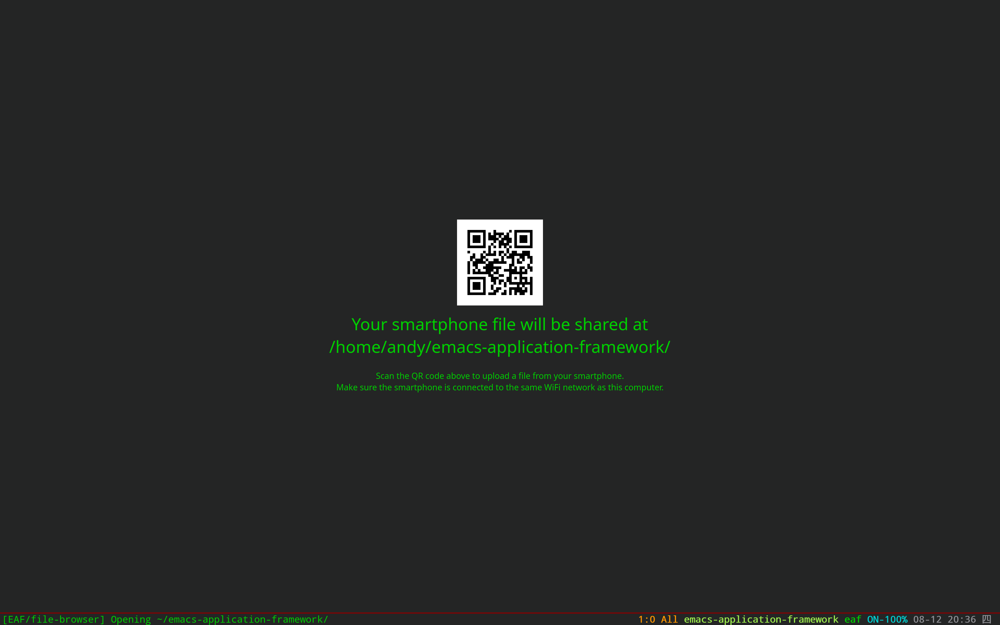

### EAF File Browser
<p align="center">
  
</p>

File browser application for the [Emacs Application Framework](https://github.com/emacs-eaf/emacs-application-framework).

### Load application

[Install EAF](https://github.com/emacs-eaf/emacs-application-framework#install) first, then add below code in your emacs config:

```Elisp
(add-to-list 'load-path "~/.emacs.d/site-lisp/emacs-application-framework/")
(require 'eaf)
(require 'eaf-file-browser)
```

### Dependency List

| Package        | Description          |
| :--------      | :------              |
| python-qrcode                  | Render QR code pointing to local files                             |
| filebrowser-bin                                         | Share files between computer and smartphone                        |
